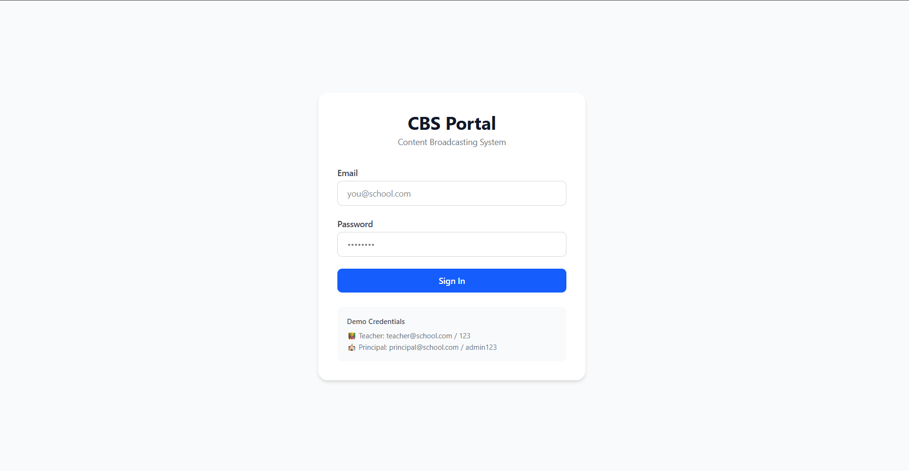
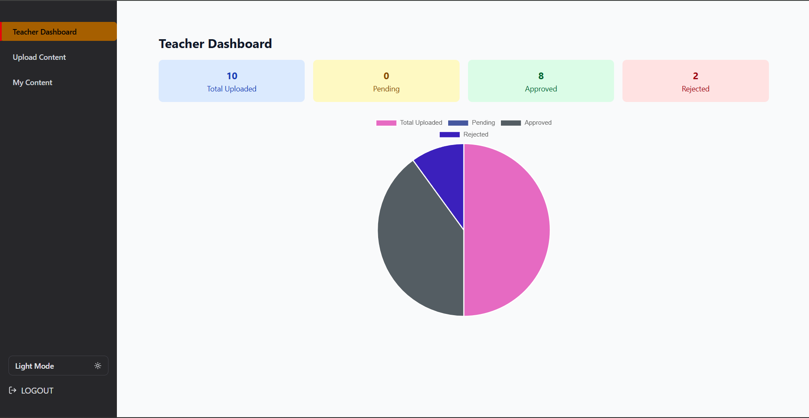
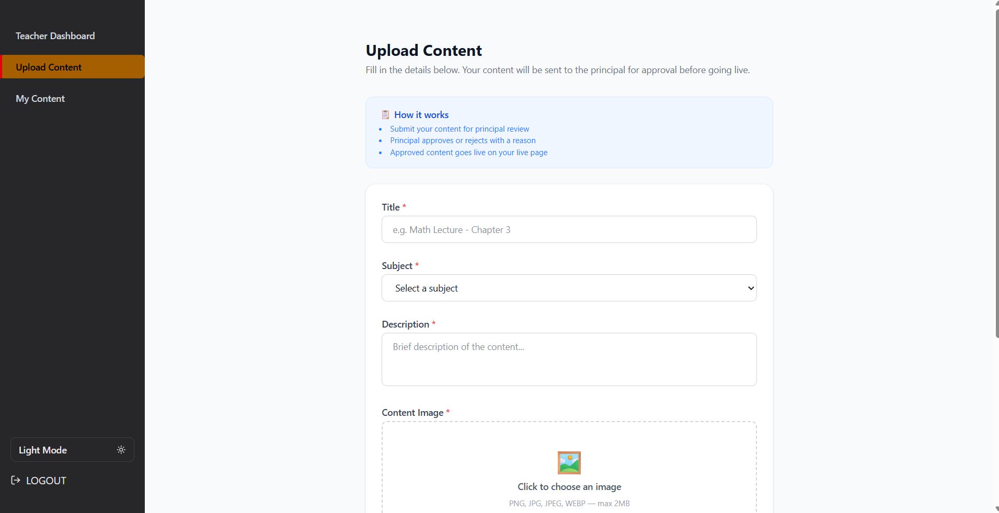
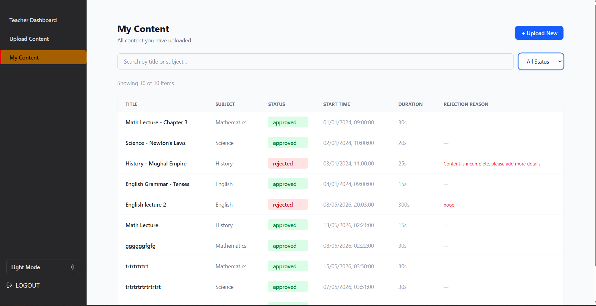
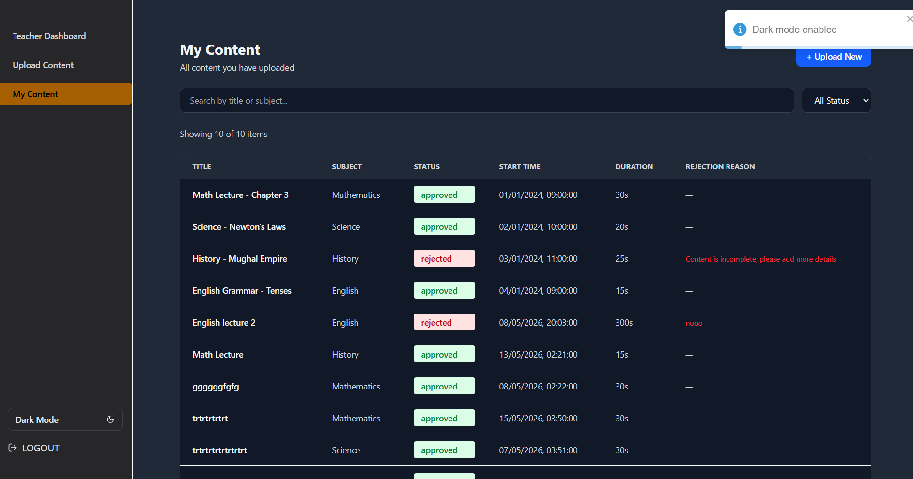

# React + Vite

# 📡 Control Broadcasting System


A role-based **content broadcasting system** where teachers can upload educational content and principals can approve/reject it. Includes a live content display system with role-based dashboards.

---

# 🚀 Live Demo

- 🌐 Frontend vercel: (https://control-broadcasting-system-f-git-232261-akshgupta007s-projects.vercel.app/)
- 🔗 Backend:
-  https://control-broadcasting-system-frontend-1.onrender.com/
-  https://control-broadcasting-system-frontend-1.onrender.com/users
-  https://control-broadcasting-system-frontend-1.onrender.com/content
-   https://control-broadcasting-system-frontend-1.onrender.com/approval_logs


# to Login As teacher
    "email": "teacher@school.com",
   "password": "123",
    "role": "teacher"
---

#  To login AS principal 
      "email": "principal@school.com",
      "password": "admin123",
      "role": "principal"

# 🧠 Features

## 👨‍🏫 Teacher
- Upload content (images for now)
- View content status (pending/approved/rejected)
- Dashboard analytics

## 🧑‍💼 Principal
- View all content
- Approve / Reject submissions
- Add rejection reasons
- Track approval logs // pending feature but will add soon

## 📺 Live System & Features
- Only approved content is shown
- Dynamic content rotation system
- have option to toggle dark mode
- can reload upto 1000 cards at same time
- useMemo to prevent re-renders
- use of Thunk everywhere
- Structured Hireachy and Api Calss

---

# ⚙️ Tech Stack

### Frontend
- React (Vite)
- Redux Toolkit
- React Router DOM
- Axios
- Tailwind CSS

### Backend (Mock)
- json-server
- Node.js custom server wrapper
- db.json database

### Deployment
- Vercel (Frontend)
- Render (Backend)

---


### ScreenShots

















# 📁 Project Structure

```txt
cb/
├── Backend/
│   ├── db.json
│   ├── server.js
│   ├── package.json
│
├── src/
│   ├── Components/
│   ├── Pages/
│   ├── Services/
│   ├── Slices/
│   ├── Store/
│
├── vercel.json
├── package.json

